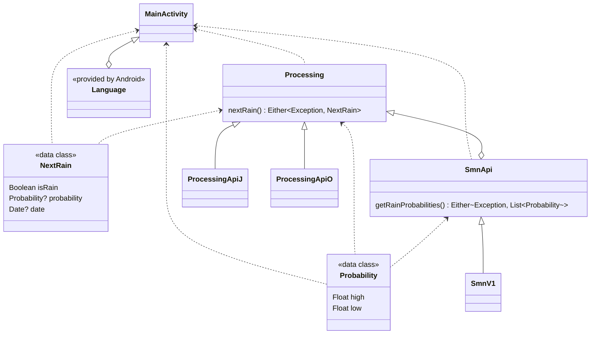

# Rain Detector

## Modules

```mermaid
classDiagram

class NextRain {
    <<data class>>
    Boolean isRain
    Probability? probability
    Date? date
}
class Probability {
    <<data class>>
    Float high
    Float low
}

class SmnApi {
    getRainProbabilities() Either~Exception, List~Probability~~
}

SmnApi <|-- SmnV1
SmnApi <.. Probability

class Processing {
    nextRain() Either~Exception, NextRain~
}

Processing <|-- ProcessingApiJ
Processing <|-- ProcessingApiO

Processing <|--o SmnApi
Processing <.. Probability
Processing <.. NextRain

class Language {
    <<provided by Android>>
}

MainActivity <|--o Language

MainActivity <.. NextRain
MainActivity <.. Probability
MainActivity <.. Processing
MainActivity <.. SmnApi
```

