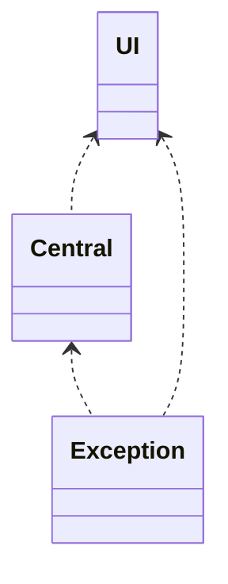
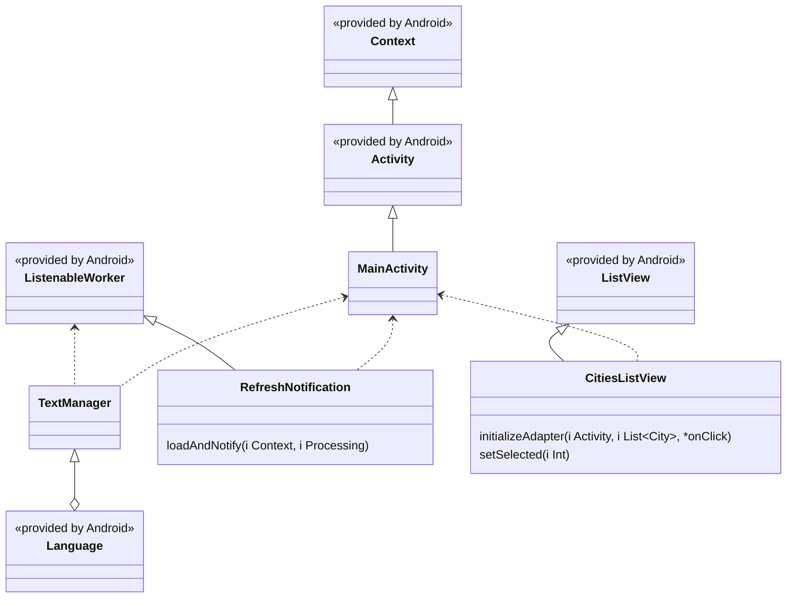
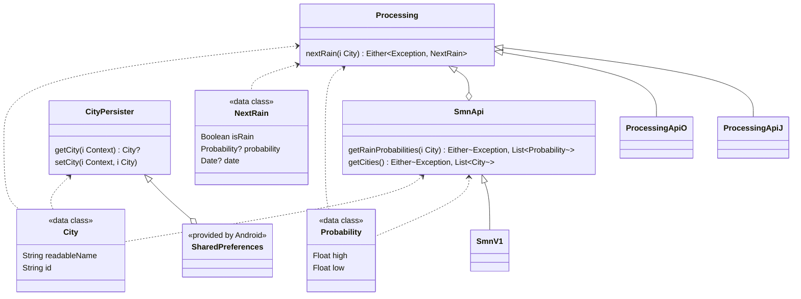
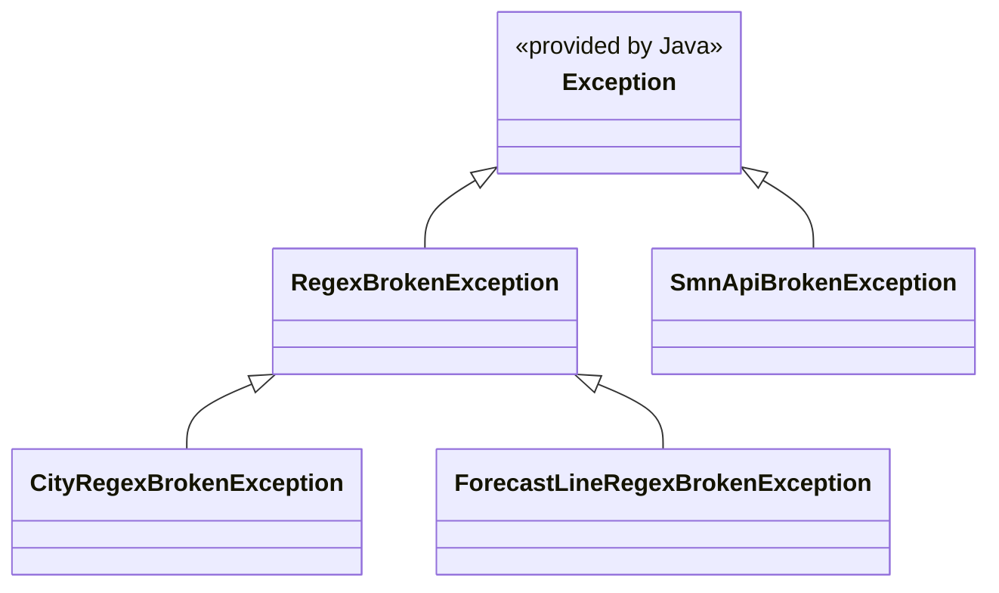

# Rain Detector

## Supermodules

```mermaid
classDiagram
Central <.. Exception
UI <.. Exception
UI <.. Central
```

## Modules

### UI

```mermaid
classDiagram
class Language {
    <<provided by Android>>
}

class Context {
    <<provided by Android>>
}

class Activity {
    <<provided by Android>>
}

class ListView {
    <<provided by Android>>
}

class ListenableWorker {
    <<provided by Android>>
}

TextManager <|--o Language

class RefreshNotification {
    loadAndNotify(i Context, i Processing)
}

ListenableWorker <|-- RefreshNotification 

ListenableWorker <.. TextManager

class CitiesListView {
    initializeAdapter(i Activity, i List~City~, *onClick)
    setSelected(i Int)
}

ListView <|-- CitiesListView


Context <|-- Activity 
Activity <|-- MainActivity 

MainActivity <.. TextManager
MainActivity <.. RefreshNotification
MainActivity <.. CitiesListView
```

### Central

```mermaid
classDiagram
class SharedPreferences {
    <<provided by Android>>
}

class NextRain {
    <<data class>>
    Boolean isRain
    Probability? probability
    Date? date
}
class Probability {
    <<data class>>
    Float high
    Float low
}

class City {
    <<data class>>
    String readableName
    String id
}

class CityPersister {
    getCity(i Context) City?
    setCity(i Context, i City)
}

CityPersister <|--o SharedPreferences

CityPersister <.. City

class SmnApi {
    getRainProbabilities(i City) Either~Exception, List~Probability~~
    getCities() Either~Exception, List~City~~
}

SmnApi <|-- SmnV1
SmnApi <.. Probability
SmnApi <.. City

class Processing {
    nextRain(i City) Either~Exception, NextRain~
}

Processing <|-- ProcessingApiJ
Processing <|-- ProcessingApiO

Processing <|--o SmnApi
Processing <.. Probability
Processing <.. NextRain
Processing <.. City
```

### Exception

```mermaid
classDiagram
class Exception {
    <<provided by Java>>
}

Exception <|-- RegexBrokenException
Exception <|-- SmnApiBrokenException

RegexBrokenException <|-- CityRegexBrokenException
RegexBrokenException <|-- ForecastLineRegexBrokenException
```

